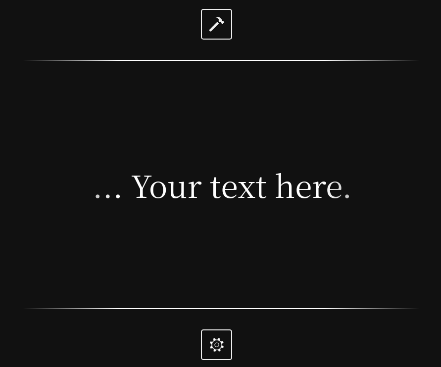

Description & Purpose:

    This is a simple left-to-right, single line scrolling reader to help me read.
    It currently is hosted as a static page on GitHub pages at: 

Click <a href="https://jlobbes.github.io/phone-reader-project/">here</a> to try it out.

    Click the image-link below to watch a demo introduction on Vimeo:

  

    